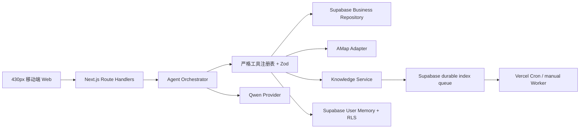

# 小智｜本地生活 AI 服务助手

面向 AI FDE / Solutions Engineer 面试的移动端 Web 作品集。产品以微信小程序式 430px 画布演示，将结构化业务查询、地图工具、可追溯 RAG、多工具编排和受控知识运营闭环组合在同一套 Agent 架构中。

**Production Live：** [https://xiaozhi.zaneyang.xyz](https://xiaozhi.zaneyang.xyz)

## 当前真实状态

- Production 已使用 `NEXT_PUBLIC_DEMO_MODE=false`，Supabase、百炼千问、高德和历史房源均报告 `configured`。
- 2024-11 杭州历史房源共 60,202 条已导入 Supabase；页面和回答均标记为历史数据，不代表当前可租。
- 千问已在线完成流式多轮 Function Calling；高德已在线完成地理编码、周边 POI 和步行路线验证。
- 房源 + 高德、商品 + 偏好提案两条 Live 多工具链路已连续回归通过；点赞反馈会写入 Supabase。
- 四份作品集首方公开资料已通过候选、审核、原子发布、持久化队列和独立 Worker 生成真实百炼 Embedding；Production 固定评测 20/20 通过，其中 4/4 千问自然问法用例同时通过强制取证、事实、版本、首方来源与引用范围检查。
- 受保护的 AI Ops 视图会按每次 `qwen-plus` 请求的输入长度分档估算人民币成本，并显示覆盖率、价格核验日和排除项；它不是阿里云账单。
- Supabase 提供跨 Vercel 实例的工具审计、全部 API Route 安全元数据检索和六类站内阈值状态，并已实现事故认领、解决、自动恢复与不可变事件审计；检索不返回工具载荷、查询参数、正文、Cookie、Authorization、IP 或响应正文。外部通知和真实值班升级尚未接入，不能称为完整企业告警平台。
- Chat、Feedback、公开 Knowledge Search、地图直连和受保护的知识评测已使用 Supabase 原子共享限流；客户端标识先经服务端 HMAC-SHA256，不保存原始 IP。登录使用公开固定演示码映射到隔离的共享 Supabase 演示账号，并明确提示不要填写真实隐私。
- 团购、商品、库存、订单和社区内容仍是明确标注的演示业务，不对应真实交易。
- 作品集首方资料只证明本项目公开边界的 RAG 质量；用户尚未提供企业客服话术、内部制度或客户业务政策，因此不能宣称已经完成真实企业知识库交付。
- Production 知识运营管理员口令已经配置并完成登录、Cookie、退出和受控材料录入验收。固定演示码 Auth 已完成真实 Session、RLS 偏好、退出、重登和清理验收；`qwen3-rerank` 在线调用仍未配置。

## 数据真实性

| 能力                   | 当前来源                       | 对外表述                           |
| ---------------------- | ------------------------------ | ---------------------------------- |
| 房源                   | Supabase 中的 2024-11 历史数据 | `2024 历史房源数据`，不是实时可租  |
| 周边与路线             | 高德 Web Service API           | `高德地图`                         |
| 团购、商品、库存、订单 | Supabase 演示业务数据          | `演示数据` / `演示订单`            |
| 对话与反馈             | 当前产品中的真实用户操作       | 持久化到 Supabase                  |
| 作品集知识             | 4 份首方公开资料               | `作品集首方说明`，可追溯版本与引用 |
| 客服政策               | 尚无企业正式材料               | 预置政策只标为 `模拟知识资料`      |

## 架构



大模型负责理解、选择工具和表达；价格、库存、状态、距离和政策等事实必须来自对应工具。React 页面不写 SQL，也不接触 service role、高德或百炼密钥。

## 技术栈

- Next.js App Router、React、TypeScript strict、Tailwind CSS
- Supabase PostgreSQL、RLS、pgvector
- 百炼 OpenAI 兼容 API、Function Calling、Embedding、Rerank
- 高德 Web Service API
- Zod、Vitest、Testing Library、Playwright
- Python、FastAPI、Pydantic、SQLite R-Tree（本机历史房源服务）
- pnpm、Vercel

## 快速开始

```powershell
cd web
pnpm install --frozen-lockfile
Copy-Item .env.example .env.local
pnpm dev
```

保持 `NEXT_PUBLIC_DEMO_MODE=true` 即可运行不依赖外部账号的作品集 Demo。知识管理页还需要在 `.env.local` 设置至少 32 位的 `DEMO_ADMIN_TOKEN`。

若要让小智查询本机 2024-11 真实历史房源，先按 [房源 API 说明](services/housing-api/README.md) 启动服务，再在 `web/.env.local` 同时配置 `HOUSING_API_BASE_URL` 与 `HOUSING_API_KEY`。该能力仍是历史数据，不代表当前可租。

完整质量门：

```powershell
pnpm lint
pnpm typecheck
pnpm test
$env:PLAYWRIGHT_PORT='3310'; pnpm test:e2e
pnpm build
```

Production Live 回归：

```powershell
$env:EXPECTED_PRODUCTION_MODE='live'
pnpm deploy:verify-production
```

该命令会创建两条测试对话和一条点赞反馈，不用于高频监控。

## 关键文档

- [应用说明](web/README.md)
- [三分钟演示脚本](qa/demo-script.md)
- [部署手册](web/docs/deployment.md)
- [故障运行手册](web/docs/runbook.md)
- [配置与账号接入](docs/14-configuration-guide.md)
- [知识库材料准备清单](docs/15-knowledge-material-intake.md)
- [零基础学习与面试路线](docs/17-beginner-learning-path.md)
- [验收标准](docs/11-acceptance-criteria.md)
- [Production Live 部署证据](docs/task-reports/2026-08-12-vercel-production-baseline.md)
- [作品集首方 RAG 证据](docs/task-reports/2026-08-13-portfolio-first-party-rag.md)
- [RAG 恢复与防复发证据](docs/task-reports/2026-08-13-rag-embedding-recovery.md)
- [第 1 课真实请求链路练习单](docs/19-lesson-01-real-request-path.md)
- [知识索引 Worker 证据](web/docs/task-reports/2026-08-12-knowledge-index-worker.md)
- [AI 成本估算证据](web/docs/task-reports/2026-08-12-ai-cost-estimate.md)
- [受保护 Preview 部署证据](docs/task-reports/2026-08-12-vercel-preview-baseline.md)
- [面试问答指南](docs/10-interview-guide.md)
- [Task 10 知识闭环报告](docs/task-reports/2026-08-11-task-10-governed-knowledge-loop.md)
- [Task 11 安全加固报告](docs/task-reports/2026-08-11-task-11-service-hardening.md)
- [本机历史房源接入报告](docs/task-reports/2026-08-11-housing-http-integration.md)
- [公开业务 API 契约对齐报告](docs/task-reports/2026-08-11-task-13-public-business-api.md)

Vercel Root Directory 固定为 `web/`。
