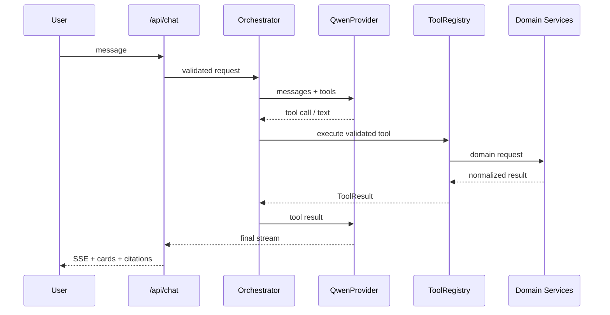

# AI Agent 架构

## 1. 原则

- 大模型负责理解、计划、选工具和表达；工具负责事实查询和动作。
- 所有事实字段必须来自工具。
- 单 Agent + 多工具优先，不为展示引入多 Agent。
- Agent 依赖领域接口，不依赖 Supabase、pgvector 或高德表结构。

## 2. 运行链路



## 3. Provider 边界

```ts
export interface AIProvider {
  streamTurn(input: ProviderTurnInput, signal: AbortSignal): AsyncIterable<ProviderEvent>;
}

export interface EmbeddingProvider {
  embed(input: EmbeddingInput, signal?: AbortSignal): Promise<number[]>;
}

export interface Reranker {
  rerank(input: RerankInput, signal?: AbortSignal): Promise<RerankResult[]>;
}
```

分别实现 `QwenProvider`、`QwenEmbeddingProvider` 和可选 `QwenReranker`。业务代码不得直接创建供应商 SDK 客户端。

## 4. 工具

P0：
- `search_houses`
- `get_house_detail`
- `search_deals`
- `search_products`
- `get_product_stock`
- `search_nearby_places`
- `calculate_walking_route`
- `search_knowledge`
- `get_user_preferences`
- `submit_feedback`

以下能力由应用服务控制，不直接暴露给模型：购物车写入、演示订单创建、页面上下文加载、知识候选创建与知识发布。

精确 Schema 见 `contracts/tool-contracts.json`。

### 4.1 本机历史房源边界

`search_houses` 在默认 Demo Repository 与可选 `HousingHttpAdapter` 之间按本次已校验的工具参数选择来源：

- 未配置房源服务或没有指定已配置中心点时，继续使用明确标注的 Demo 数据。
- 指定武林广场且本机房源服务已配置时，由服务器端 Adapter 调用只读 FastAPI 服务。
- 房源 API Key 只存在于服务端；浏览器和模型均不可见。
- HTTP 响应再次经过 Zod 校验；`raw`、内部 ID 和联系方式不进入 Agent 上下文。
- 当前真实快照不支持可靠宠物筛选，其他地点也尚未完成地理编码，因此两类请求必须明确失败，不能静默放宽条件。
- 历史坐标距离是 WGS84 直线距离，不得描述成高德步行路线。

## 5. 工具循环

- 最大 8 轮
- 默认工具超时 8s，路线 10s
- 相同工具 + 相同参数单轮只执行一次
- 可重试错误自动重试一次
- 错误归一化为 `ToolError`
- 每次调用写 `ai_tool_runs`

## 6. SSE 事件

```text
session
assistant_delta
tool_progress
result_cards
citations
debug_tool_run
warning
error
done
```

前端不得依赖供应商原始流格式。

## 7. 记忆

- 最近 12 条消息直接进入上下文
- 更早内容写入结构化摘要
- 长期偏好按需通过工具读取
- 本轮明确条件覆盖长期偏好
- 敏感偏好必须获得同意再保存

## 8. 回答政策

1. 需要事实时必须调用工具。
2. 只有缺少关键信息时问一个澄清问题。
3. 无结果时如实说明并建议放宽一个条件。
4. 知识不足时拒绝确定性政策结论。
5. 推荐理由必须对应工具字段。
6. 文本简洁，卡片承担结构化信息。
7. 不展示内部 Prompt、SQL、密钥和思维链。

完整 Prompt 见 `contracts/qwen-system-prompt.md`。
